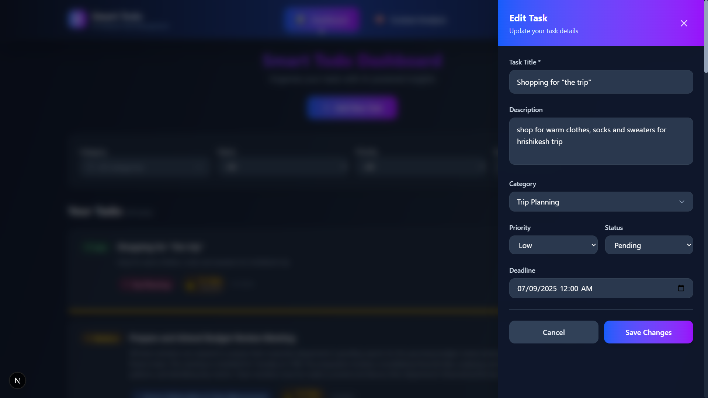

# 🤖 Smart Todo List with AI Integration

A full-stack web application for intelligent task management with AI-powered features like task prioritization, deadline suggestions, and context-aware recommendations.

## 🚀 Features

### Core Features
- ✅ **Task Management**: Create, edit, delete, and organize tasks
- ✅ **Smart Categorization**: AI-powered task categorization and tag suggestions
- ✅ **Priority Scoring**: AI-driven priority calculation based on context
- ✅ **Deadline Suggestions**: Intelligent deadline recommendations
- ✅ **Context Analysis**: Analyze emails, messages, and notes for task extraction
- ✅ **Task Enhancement**: AI-powered task description improvements

### AI Integration
- 🤖 **Google Gemini AI**: Advanced language model for intelligent analysis
- 📊 **Context Processing**: Extract actionable tasks from daily context
- 🎯 **Smart Prioritization**: AI-driven task ranking and urgency assessment
- 📅 **Intelligent Scheduling**: Deadline suggestions based on workload and complexity
- 🏷️ **Auto-categorization**: Smart category and tag suggestions

### User Interface
- 🎨 **Modern Design**: Clean, responsive interface with Tailwind CSS
- 🌙 **Dark Mode**: Automatic dark/light mode based on system preference
- 📱 **Mobile Responsive**: Works seamlessly on all devices
- ⚡ **Real-time Updates**: Instant feedback and updates

## 📸 Screenshots

### Dashboard View


### Task creation and updation Views




### Context Analysis


## 🏗️ Architecture

```
Smart Todo List/
├── backend/                 # Django REST API
│   ├── ai_service/         # AI integration services
│   ├── services/           # Business logic layer
│   ├── todo/              # Main Django app
│   └── tasks/             # AI-specific views
└── frontend/              # Next.js React app
    ├── src/
    │   ├── app/           # Next.js app router
    │   ├── components/    # React components
    │   ├── services/      # API client
    │   └── types/         # TypeScript definitions
```

## 📋 Prerequisites

- **Python 3.8+**
- **Node.js 18+**
- **PostgreSQL** (or Supabase account)
- **Google AI API Key** (Gemini)

## 🛠️ Quick Setup

### 1. Clone and Setup Backend

```bash
git clone <your-repo-url>
cd smart-todo-list/backend

# Create virtual environment
python -m venv venv
venv\Scripts\activate  # Windows
# source venv/bin/activate  # macOS/Linux

# Install dependencies
pip install -r requirements.txt

# Create .env file
echo "SECRET_KEY=your-django-secret-key-here
DEBUG=True
DB_NAME=smart_todo_db
DB_USER=your_db_user
DB_PASSWORD=your_db_password
DB_HOST=localhost
DB_PORT=5432
GEMINI_API_KEY=your-gemini-api-key-here
GEMINI_MODEL=gemini-2.5-flash-lite-preview-06-17
CORS_ALLOWED_ORIGINS=http://localhost:3000" > .env

# Setup database
python manage.py makemigrations
python manage.py migrate

# Start backend
python manage.py runserver
```

### 2. Setup Frontend

```bash
cd ../frontend

# Install dependencies
npm install

# Create .env.local
echo "NEXT_PUBLIC_API_URL=http://localhost:8000/api" > .env.local

# Start frontend
npm run dev
```

### 3. Access Application

- **Frontend**: http://localhost:3000
- **Backend API**: http://localhost:8000/api

## 📚 API Documentation

### Base URL
```
http://localhost:8000/api
```

### Core Endpoints

#### Tasks
- `GET /tasks/` - Get all tasks
- `POST /tasks/` - Create new task
- `GET /tasks/{id}/` - Get specific task
- `PUT /tasks/{id}/` - Update task
- `DELETE /tasks/{id}/` - Delete task

#### Categories
- `GET /categories/` - Get all categories
- `POST /categories/` - Create new category

#### Context
- `GET /context/` - Get context entries
- `POST /context/` - Add context entry

#### Statistics
- `GET /statistics/` - Get application statistics

### AI Endpoints

#### AI Health Check
```bash
GET /ai/health-check/
```
Response:
```json
{
  "status": "success",
  "ai_health": {
    "services_available": true,
    "gemini_client": true,
    "ai_pipeline": true
  },
  "model_info": {
    "current_model": "gemini-2.5-flash-lite-preview-06-17"
  }
}
```

#### Process Task with AI
```bash
POST /ai/process-task/
```
Request:
```json
{
  "task": {
    "title": "Prepare quarterly report",
    "description": "Create comprehensive quarterly sales report"
  },
  "context": {
    "content": "Deadline is Friday, client meeting scheduled"
  }
}
```

#### Create Enhanced Task
```bash
POST /ai/create-enhanced-task/
```
Request:
```json
{
  "task": {
    "title": "Prepare quarterly report",
    "description": "Create comprehensive quarterly sales report"
  },
  "context": {
    "content": "Deadline is Friday, client meeting scheduled"
  },
  "auto_create": true
}
```

#### Analyze Context
```bash
POST /ai/analyze-context/
```
Request:
```json
{
  "context": {
    "content": "Meeting scheduled for Friday. Need to prepare quarterly report.",
    "source": "email",
    "timestamp": "2024-01-01T10:00:00Z"
  }
}
```

#### Suggest Category
```bash
POST /ai/suggest-category/
```
Request:
```json
{
  "task_title": "Prepare quarterly report",
  "task_description": "Create comprehensive quarterly sales report"
}
```

#### Enhance Description
```bash
POST /ai/enhance-description/
```
Request:
```json
{
  "task_title": "Prepare quarterly report",
  "current_description": "Create quarterly report"
}
```

## 🧪 Sample Tasks and AI Suggestions

### Sample Context Input
```
Subject: Client Meeting Preparation
From: manager@company.com

Hi team,
We have a client meeting scheduled for Friday at 2 PM. Please prepare the quarterly sales report and have the new product demo ready. The client is particularly interested in our Q4 performance and upcoming features.

Also, don't forget to update the project documentation by end of this week.

Best regards,
Manager
```

### AI-Generated Tasks
```json
{
  "extracted_tasks": [
    {
      "title": "Prepare Quarterly Sales Report",
      "description": "Create comprehensive quarterly sales report for client meeting on Friday. Include Q4 performance metrics, revenue analysis, and growth projections. Focus on key performance indicators and market trends.",
      "priority": "high",
      "deadline": "2024-01-05",
      "category": "Reports",
      "confidence": 0.95
    },
    {
      "title": "Prepare Product Demo",
      "description": "Set up and test new product features for client demo. Ensure all features are working properly, prepare presentation slides, and rehearse the demo flow. Include upcoming features showcase.",
      "priority": "high",
      "deadline": "2024-01-05",
      "category": "Presentations",
      "confidence": 0.92
    },
    {
      "title": "Update Project Documentation",
      "description": "Complete documentation updates by end of week. Review and update technical specifications, user guides, and API documentation. Ensure all recent changes are properly documented.",
      "priority": "medium",
      "deadline": "2024-01-05",
      "category": "Documentation",
      "confidence": 0.88
    }
  ]
}
```

### AI Enhancement Examples

## 🎯 Usage Examples

### 1. Creating a Task with AI Enhancement
1. Navigate to Dashboard
2. Click "Add Task"
3. Enter basic task information
4. Use AI suggestions for priority, category, deadline, and description enhancement

### 2. Context Analysis
1. Go to Context page
2. Paste context data (emails, messages, notes)
3. Click "Analyze Context"
4. Review AI-generated tasks and suggestions

### 3. Smart Task Management
1. View tasks on Dashboard
2. Use filters to organize by status, priority, category
3. Edit tasks with AI-powered suggestions

## 🔧 Configuration

### AI Model Selection
```bash
# For highest rate limits (development)
GEMINI_MODEL=gemini-2.5-flash-lite-preview-06-17

# For standard performance
GEMINI_MODEL=gemini-2.5-flash

# For very high rate limits
GEMINI_MODEL=gemma-3-2b
```

### Database Configuration
The application supports PostgreSQL. For production, consider using Supabase:
1. Create a Supabase project
2. Get your database credentials
3. Update the `.env` file with Supabase connection details

## 🚀 Deployment

### Backend (Railway/Heroku)
```bash
# Set environment variables
SECRET_KEY=your-secret-key
GEMINI_API_KEY=your-api-key
DATABASE_URL=your-database-url

# Deploy
git push heroku main
```

### Frontend (Vercel/Netlify)
1. Connect your GitHub repository
2. Set environment variables
3. Deploy automatically

## 🐛 Troubleshooting

### Common Issues
- **AI Services Not Available**: Check `GEMINI_API_KEY` configuration
- **Database Connection**: Verify PostgreSQL is running and credentials are correct
- **Frontend API Errors**: Ensure backend is running on port 8000 and CORS is configured

### Rate Limit Issues
If you encounter rate limit errors:
1. Switch to `gemini-2.5-flash-lite-preview-06-17` model
2. Check your API quota in Google AI Studio

## 📝 Contributing

1. Fork the repository
2. Create a feature branch
3. Make your changes
4. Submit a pull request

## 📄 License

This project is licensed under the MIT License.

---

**Built with ❤️ using Django, Next.js, and Google Gemini AI** 